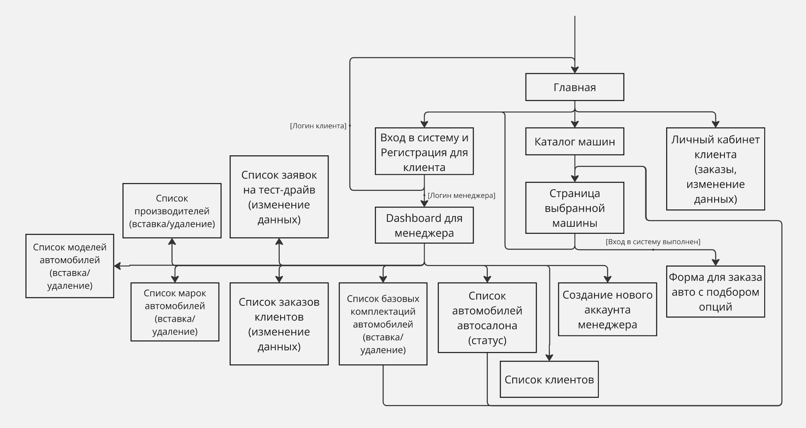
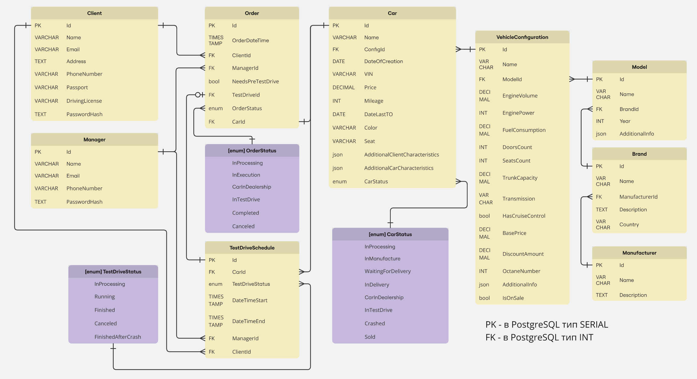

# Информационная система автосалона (вариант 2)

# Часть 1

## Описание страниц

### Шапка каждой из страниц
- Кнопка "Главная"
- Кнопка "Каталог"
- Кнопка для перехода на страницу Входа в систему и Регистрации / Кнопка перехода к личному кабинету (Dashboard для менеджера) + Кнопка выхода из аккаунта

### Главная
- Заголовок с приветствием + Фото автосалона + Контакты
- Кнопка перехода к каталогу
- Карточки 5 самых популярных машин + Скидки

### Вход в систему и Регистрация клиента
- Форма слева для ввода почты и пароля - Вход в систему. Клиент после входа попадает на Главную, менеджер - в Dashboard.
- Форма справа для ввода имени, почты, номера телефона, пароля - Регистрация клиента

### Личный кабинет клиента
- Форма для изменения личных данных клиента. Нажатие кнопки "Сохранить" сохраняет изменения.
- Список совершенных заказов и тест-драйвов. Нажатие кнопки "Отмена" у непереданных в производство заказов и не начатых тест-драйвов отменяет их.

### Каталог машин
- Поиск и фильтры по характеристикам автомобилей (объем двигателя, цвет, пробег и т.д.)
- Карточки автомобилей: сначала идут карточки автомобилей из автосалона, после них идут карточки всех возможных моделей и комплектаций под заказ из завода. Нажатие на карточку переводит на соответствующую страницу выбранной модели.

### Страница выбранной модели
- Фото автомобиля
- Название марки, модели, комплектации
- Его характеристики и цена
- Форма заявки на тест-драйв (указание даты и времени)
- Кнопка для заказа (переход на форму заказа авто)

### Форма для заказа авто
Если автомобиль под заказ из завода: 

- Выбор комплектации, дополнительных опций
- Выбор цвета и обивки кресел
- Калькулятор стоимости
- Чекбокс "Нужен ли тест-драйв?". Если да, то время назначается позже по договоренности с менеджером.
- Кнопка заказа, после чего переход в личный кабинет

Если автомобиль из автосалона:

- Стоимость машины
- Чекбокс "Нужен ли тест-драйв?". Если да, то время назначается позже по договоренности с менеджером.
- Кнопка заказа, после чего переход в личный кабинет

Если выполнен вход менеджера, то сверху будет выпадающий список для выбора клиента.

### Dashboard для менеджера
- Кнопки для перехода к страницам для менеджера
- Список уведомлений по заказам и заявкам (которые нужно обработать)

### Список заказов клиентов
- Изменение данных по заказам (статус, данные, тест-драйв). Нажатие кнопки "Сохранить" сохраняет изменения.
- Кнопка перехода в каталог для создания нового заказа

### Список заявок клиентов на тест-драйв
- Изменение данных по заявкам (статус, данные, даты). Нажатие кнопки "Сохранить" сохраняет изменения.
- Создание новой заявки (форма)

### Список автомобилей 
- Изменение данных автомобиля (характеристики, статус). Нажатие кнопки "Сохранить" сохраняет изменения.
- Добавление нового автомобиля (форма)

### Список базовых комплектаций автомобилей
- Изменение данных и статуса комплектации. Нажатие кнопки "Сохранить" сохраняет изменения.
- Добавление/удаление комплектаций (форма)

### Список моделей
- Изменение данных модели. Нажатие кнопки "Сохранить" сохраняет изменения.
- Добавление/удаление модели (форма)

### Список марок
- Изменение данных марок. Нажатие кнопки "Сохранить" сохраняет изменения.
- Добавление/удаление марок (форма)

### Список производителей
- Изменение данных производителя. Нажатие кнопки "Сохранить" сохраняет изменения.
- Добавление/удаление производителя (форма)

### Создание нового аккаунта менеджера
- Форма для заполнения данных нового менеджера. Нажатие кнопки "добавить" добавляет нового менеджера.

### Список клиентов
- Изменение данных клиентов. Нажатие кнопки "Сохранить" сохраняет изменения.
- Добавление нового клиента (форма как в странице Входа в систему/Регистрации)

## Описание use cases/сценариев использования

### Клиент

Клиент заходит на сайт и попадает на главную страницу сайта. Оттуда он может попасть в форму входа/регистрации, зайти в каталог автомобилей, смотреть по поиску и фильтрам доступные в автосалоне машины и доступные комплектации для заказа из автосалона. Выбрав автомобиль, клиент нажимает на карточку автомобиля, смотрит на характеристики, цену, пробег и последнее ТО.

Клиент может подать заявку на тест-драйв (если указаны все необходимые документы в профиле), после чего менеджер может подтвердить заявку на странице списка заявок на тест-драйв.

Клиент, если ему понравилась модель, может перейти на форму заказа, где он указывает цвет автомобиля, обивку салона и дополнительные опции (если автомобиль под заказ), после чего он нажимает кнопку "Заказать!". Менеджер подтверждает заявку на своей странице списка заказов, после чего заказ отправляется в производство.

### Менеджер

Менеджер заходит на сайт и попадает на главную страницу сайта. Он авторизуется в форме входа, после чего попадает в Dashboard, где он видит уведомления по заказам и заявкам на тест-драйв и кнопки перехода к его страницам:

- Список производителей (может добавить, изменить или удалить)
- Список марок автомобилей (может добавить, изменить или удалить)
- Список моделей автомобилей (может добавить, изменить или удалить)
- Список комплектаций автомобилей (может добавить, изменить или удалить)
- Список автомобилей в автосалоне (может добавить, изменить или удалить). Он меняет их статус.
- Список заказов (может создать в форме для заказа авто и менять их статус)
- Список заявок на тест-драйв (может создать, обработать онлайн-заявку и поменять статус)
- Список клиентов (может зарегистрировать, поменять данные, узнать какие у клиента были заказы)
- Форма для регистрации нового менеджера 

## Схема БД

[Скрипт создания БД](../db/create_tables.sql)

[Скрипт инициализации БД](../db/insert_into_db.sql)

[Скрипт удаления таблиц из БД](../db/drop_tables.sql)